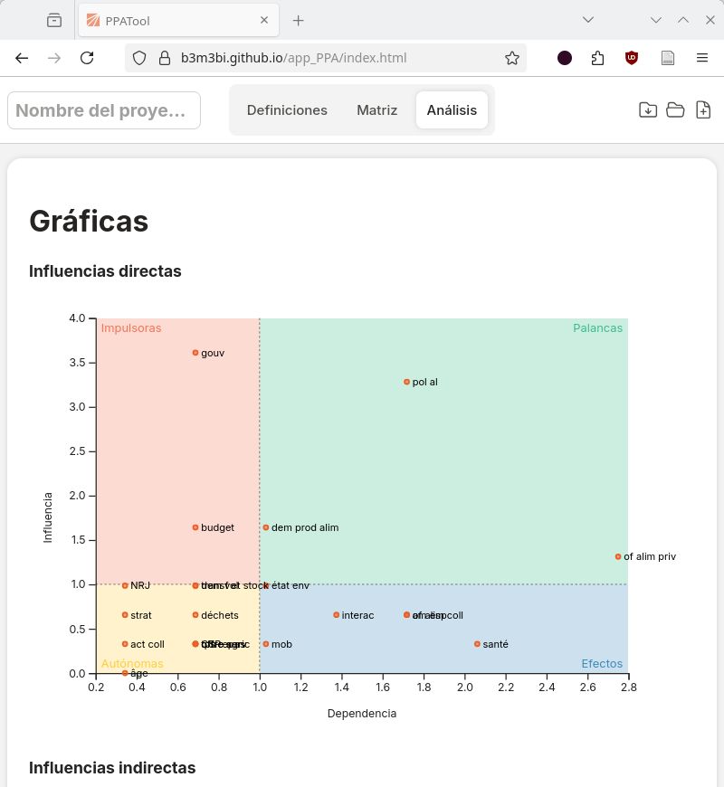

# App PPA

Esta es una herramienta para facilitar la implementación de la metodología "Análisis de Prospectiva Participativa" (PPA por sus siglas en inglés). La herramienta permite caputrar las fuerzas de cambio y las influencias entre estas, generar los análisis básicos necesarios para identificar las fuerzas impulsoras e identificar los estados incompatibles.

[Live preview](https://b3m3bi.github.io/app_PPA/index.html)

